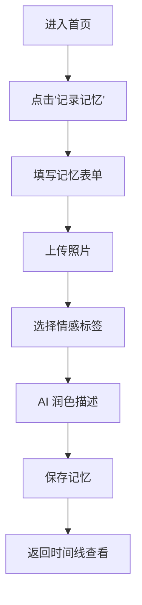
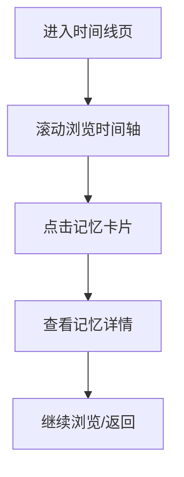
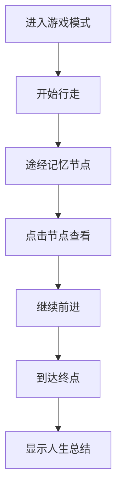

## 1. Product Overview
人生长廊（Memory Lane）是一款沉浸式人生记忆记录与回顾的 Web 应用，让分散在相册、朋友圈、日记中的零散记忆变成一条可"走"过的人生之路。

- 解决现代人记忆碎片化、难以形成完整人生叙事的问题
- 提供时间线浏览和横版卷轴游戏两种沉浸式体验方式
- 促进代际沟通，让年轻一代以全新方式理解长辈故事

## 2. Core Features

### 2.1 User Roles
| Role | Registration Method | Core Permissions |
|------|---------------------|------------------|
| Normal User | Email/Third-party auth | Record memories, browse timeline, play game mode, share stories |
| Anonymous User | No registration | Browse public gallery, view shared stories |

### 2.2 Feature Module
1. **首页**：欢迎引导、入口导航、记忆概览
2. **记忆记录页**：添加新记忆（时间、地点、情感、照片）、AI 润色
3. **时间线浏览页**：精致的时间线视图，按时间顺序展示记忆
4. **游戏模式页**：横版卷轴游戏，角色行走浏览记忆节点
5. **公共画廊**：探索他人分享的人生故事
6. **个人中心**：管理记忆、设置分享权限、查看统计

### 2.3 Page Details
| Page Name | Module Name | Feature description |
|-----------|-------------|---------------------|
| 首页 | Hero 区域 | 沉浸式欢迎动画，展示用户记忆概览统计 |
| 首页 | 导航入口 | 快速进入时间线、游戏模式、公共画廊 |
| 记忆记录页 | 表单录入 | 时间选择、地点输入、情感标签、照片上传 |
| 记忆记录页 | AI 润色 | 自动生成记忆描述，提供编辑建议 |
| 时间线浏览页 | 时间轴 | 按年份/月份组织的垂直时间线 |
| 时间线浏览页 | 记忆卡片 | 展示照片、文字描述、情感标签 |
| 游戏模式页 | 角色行走 | 横版卷轴场景，角色随滚动前进 |
| 游戏模式页 | 记忆节点 | 沿途记忆点可点击查看详情 |
| 公共画廊 | 故事列表 | 展示用户分享的公开故事 |
| 公共画廊 | 故事详情 | 浏览他人完整的人生故事 |
| 个人中心 | 记忆管理 | 编辑、删除、设置权限 |
| 个人中心 | 数据统计 | 记忆数量、时间跨度、情感分布 |

## 3. Core Process

### 用户流程：记录记忆

### 用户流程：时间线浏览

### 用户流程：游戏模式

## 4. User Interface Design

### 4.1 Design Style
- **主色调**：温暖的琥珀色 (#D4A373) + 深邃的夜空蓝 (#1D3557)
- **辅助色**：柔和的米白色 (#FAF3E0)、回忆紫 (#8D99AE)
- **按钮风格**：圆角大按钮，带有渐变和悬浮动画
- **字体**：标题使用 Georgia（衬线体，传达温暖回忆感），正文使用 Lato（无衬线体，清晰易读）
- **布局**：卡片式设计，配合大留白营造呼吸感
- **图标风格**：线性图标，温暖圆润的视觉语言

### 4.2 Page Design Overview
| Page Name | Module Name | UI Elements |
|-----------|-------------|-------------|
| 首页 | Hero 区域 | 全屏渐变背景、浮动记忆气泡动画、温暖的欢迎语 |
| 首页 | 导航入口 | 三个大卡片式按钮（时间线、游戏、画廊） |
| 记忆记录页 | 表单 | 简约输入框、日期选择器、情感标签选择 |
| 时间线浏览页 | 时间轴 | 垂直线条 + 年份标记 + 记忆卡片分布 |
| 游戏模式页 | 场景 | 横版卷轴背景（随时间变化风格）、角色行走动画 |
| 公共画廊 | 列表 | 瀑布流布局，故事卡片带封面图 |

### 4.3 Responsiveness
- **桌面端**：完整功能体验，游戏模式最佳效果
- **平板端**：自适应布局，保持核心交互
- **移动端**：简化游戏模式为滑动浏览，优化触控体验

### 4.4 3D Scene Guidance (Game Mode)
- **环境风格**：按时间阶段变化（童年-清新明亮、青年-活力多彩、中年-沉稳温暖）
- **视觉元素**：道路、树木、路标（显示年份）、记忆节点（发光的球体/书本）
- **角色**：简约的步行角色，带有影子和动画
- **交互**：点击记忆节点弹出详情卡片，继续前进自动滚动
