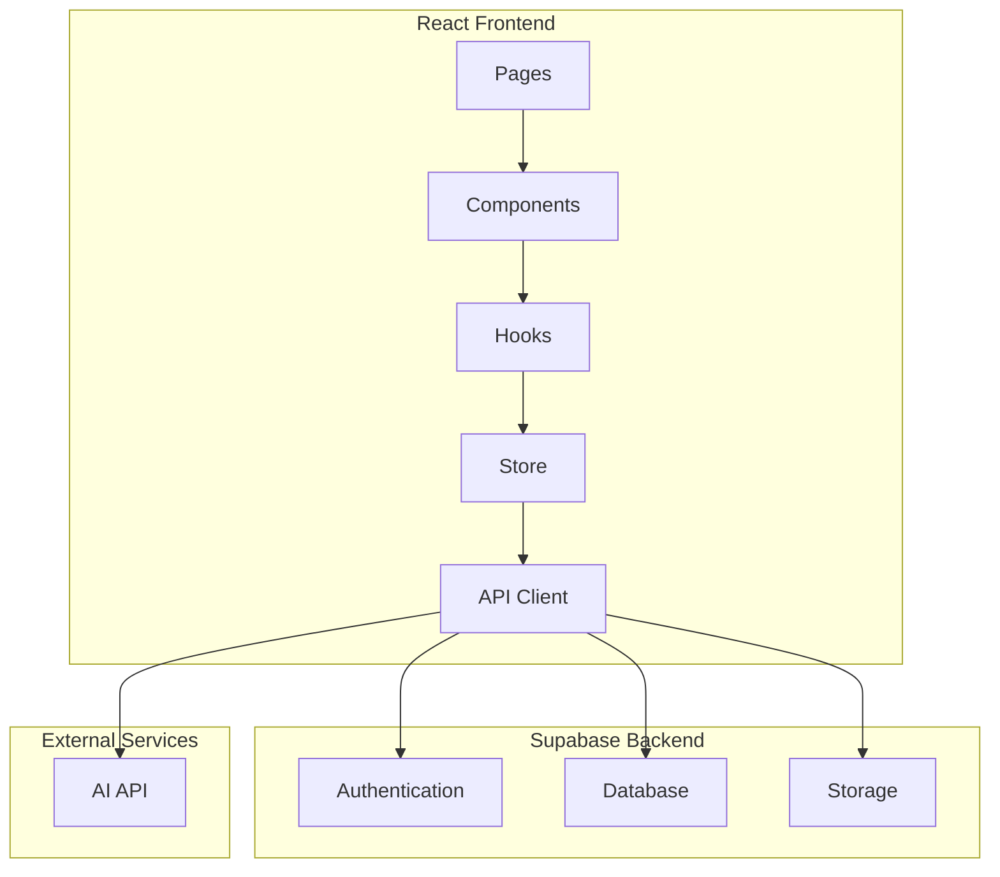
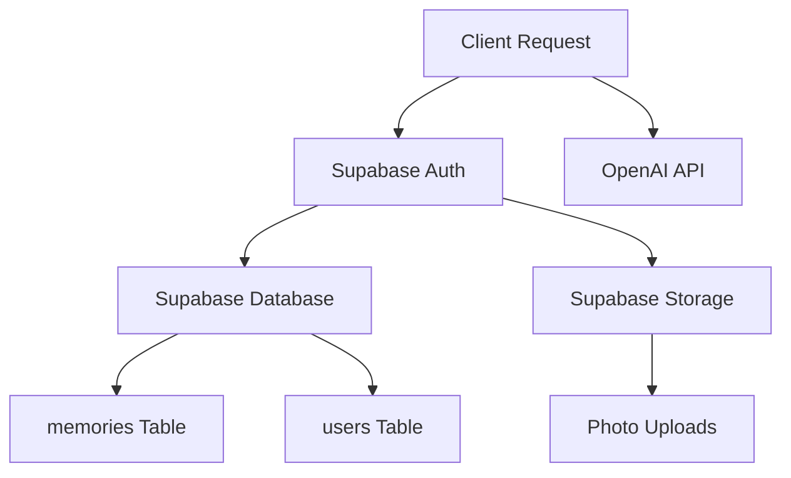
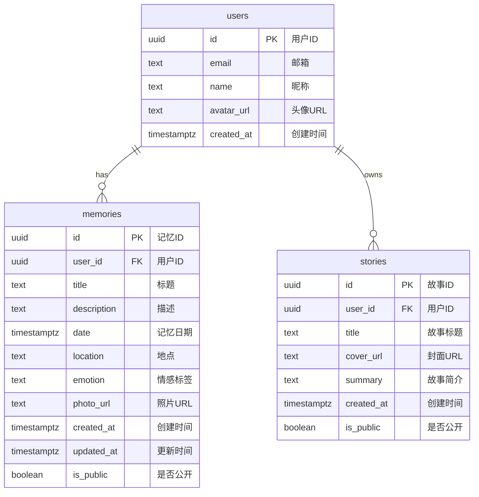

## 1. Architecture Design


## 2. Technology Description
- **Frontend**: React@18 + TypeScript + TailwindCSS@3 + Vite
- **State Management**: Zustand
- **Routing**: React Router DOM
- **Icons**: Lucide React
- **Backend**: Supabase (Authentication, Database, Storage)
- **AI Integration**: OpenAI API for memory description polish

## 3. Route Definitions
| Route | Purpose |
|-------|---------|
| / | 首页 - 欢迎引导和导航入口 |
| /timeline | 时间线浏览页 |
| /game | 游戏模式页 |
| /gallery | 公共画廊页 |
| /gallery/:storyId | 故事详情页 |
| /record | 记忆记录页 |
| /profile | 个人中心页 |
| /login | 登录/注册页 |

## 4. API Definitions

### Memory API
| Method | Endpoint | Description |
|--------|----------|-------------|
| GET | /memories | 获取当前用户所有记忆 |
| POST | /memories | 创建新记忆 |
| PUT | /memories/:id | 更新记忆 |
| DELETE | /memories/:id | 删除记忆 |

### Story API
| Method | Endpoint | Description |
|--------|----------|-------------|
| GET | /stories | 获取公共故事列表 |
| GET | /stories/:id | 获取故事详情 |
| PUT | /stories/:id/toggle-public | 切换故事公开状态 |

### AI API
| Method | Endpoint | Description |
|--------|----------|-------------|
| POST | /ai/polish | AI 润色记忆描述 |

## 5. Server Architecture Diagram


## 6. Data Model

### 6.1 Data Model Definition


### 6.2 Data Definition Language

```sql
-- users table (managed by Supabase Auth)
-- No need to create manually

-- memories table
CREATE TABLE memories (
    id UUID DEFAULT uuid_generate_v4() PRIMARY KEY,
    user_id UUID REFERENCES auth.users(id) NOT NULL,
    title TEXT NOT NULL,
    description TEXT,
    date TIMESTAMPTZ NOT NULL,
    location TEXT,
    emotion TEXT,
    photo_url TEXT,
    created_at TIMESTAMPTZ DEFAULT NOW(),
    updated_at TIMESTAMPTZ DEFAULT NOW(),
    is_public BOOLEAN DEFAULT FALSE
);

-- stories table
CREATE TABLE stories (
    id UUID DEFAULT uuid_generate_v4() PRIMARY KEY,
    user_id UUID REFERENCES auth.users(id) NOT NULL,
    title TEXT NOT NULL,
    cover_url TEXT,
    summary TEXT,
    created_at TIMESTAMPTZ DEFAULT NOW(),
    is_public BOOLEAN DEFAULT FALSE
);

-- Indexes
CREATE INDEX idx_memories_user_id ON memories(user_id);
CREATE INDEX idx_memories_date ON memories(date);
CREATE INDEX idx_memories_is_public ON memories(is_public);
CREATE INDEX idx_stories_user_id ON stories(user_id);
CREATE INDEX idx_stories_is_public ON stories(is_public);

-- RLS Policies
ALTER TABLE memories ENABLE ROW LEVEL SECURITY;
ALTER TABLE stories ENABLE ROW LEVEL SECURITY;

-- Memory policies
CREATE POLICY "Users can view their own memories" ON memories
    FOR SELECT USING (auth.uid() = user_id);

CREATE POLICY "Users can insert their own memories" ON memories
    FOR INSERT WITH CHECK (auth.uid() = user_id);

CREATE POLICY "Users can update their own memories" ON memories
    FOR UPDATE WITH CHECK (auth.uid() = user_id);

CREATE POLICY "Users can delete their own memories" ON memories
    FOR DELETE USING (auth.uid() = user_id);

CREATE POLICY "Public memories are visible to everyone" ON memories
    FOR SELECT USING (is_public = TRUE);

-- Story policies
CREATE POLICY "Users can view their own stories" ON stories
    FOR SELECT USING (auth.uid() = user_id);

CREATE POLICY "Users can insert their own stories" ON stories
    FOR INSERT WITH CHECK (auth.uid() = user_id);

CREATE POLICY "Users can update their own stories" ON stories
    FOR UPDATE WITH CHECK (auth.uid() = user_id);

CREATE POLICY "Users can delete their own stories" ON stories
    FOR DELETE USING (auth.uid() = user_id);

CREATE POLICY "Public stories are visible to everyone" ON stories
    FOR SELECT USING (is_public = TRUE);

-- Permissions
GRANT SELECT ON memories TO anon;
GRANT SELECT ON stories TO anon;
GRANT ALL PRIVILEGES ON memories TO authenticated;
GRANT ALL PRIVILEGES ON stories TO authenticated;
```
